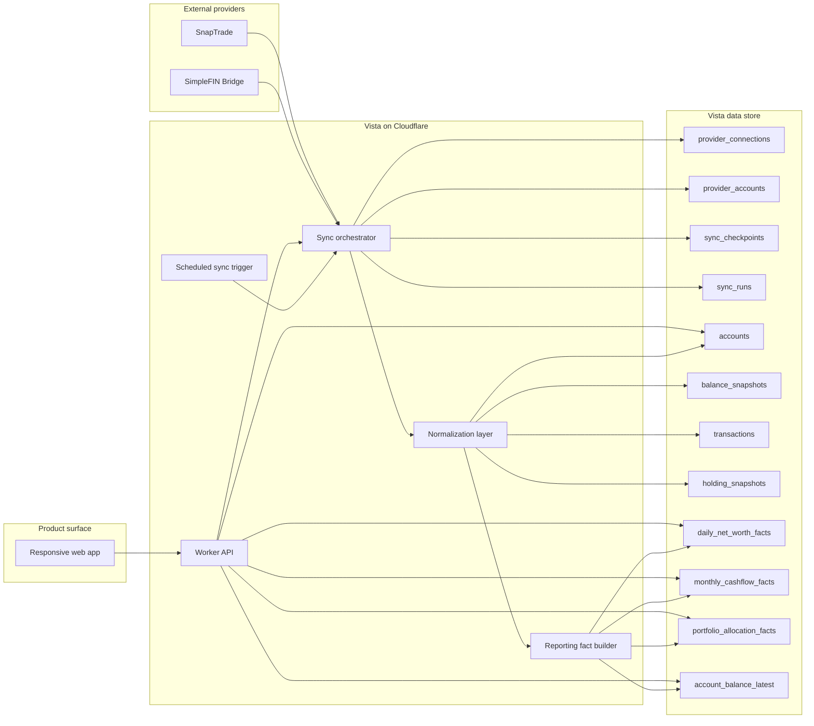
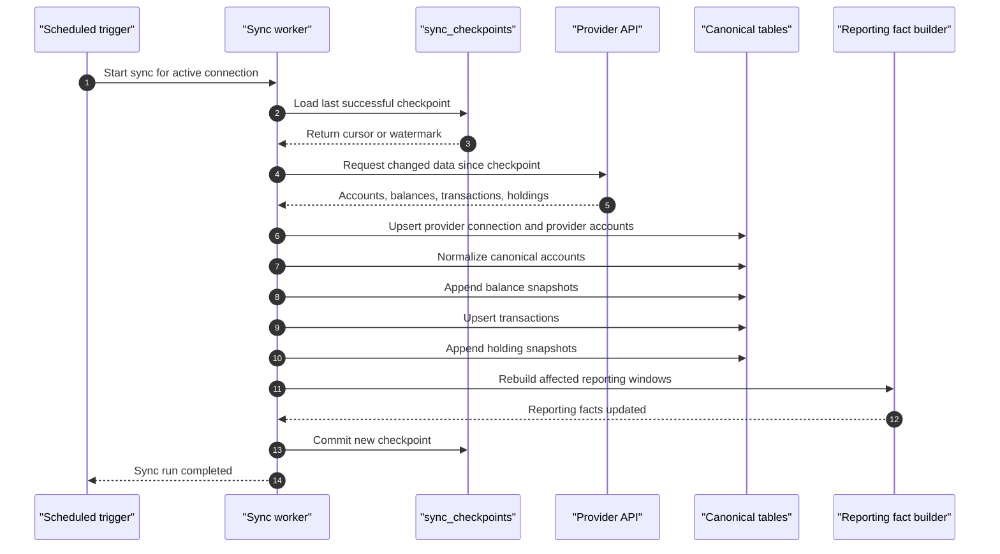

# ADR 0002: Normalized Data Model and Sync Workflow

- Status: Accepted
- Date: 2026-03-15

## Context

Vista will ingest financial data from multiple providers:

- `SimpleFIN Bridge` for banking data
- `SnapTrade` for investment data

Vista must present a unified household view even though upstream providers expose different entity models, identifiers, refresh behavior, and data shapes.

The product requirements for v1 are:

- show where money is held
- show total balances and net worth
- show portfolio composition
- show spending and savings over time
- support `mine`, `wife`, and `joint` ownership labels
- keep ingestion costs low

Vista is not intended to expose a full transaction register UI, but it still needs transaction-level source data internally for cashflow rollups and trend calculations.

## Decision

Vista will persist provider data into a normalized internal model with three layers:

1. `connection layer`
2. `canonical finance layer`
3. `reporting layer`

Sync will be `poll-first` and `daily by default`.

The system will use provider polling and cursors/checkpoints as the primary sync mechanism instead of relying on near-real-time refresh or provider-specific push features.

## Architecture Diagram

The following diagram shows the intended v1 system boundary and the separation between connectors, canonical data, and reporting reads.

## Data Model

### 1. Connection layer

This layer tracks provider-specific connectivity and sync state.

Core entities:

- `households`
- `members`
- `provider_connections`
- `provider_accounts`
- `sync_runs`
- `sync_checkpoints`
- `raw_import_artifacts`

Notes:

- `provider_connections` represent one authenticated upstream connection such as one US Bank login or one Vanguard connection
- `provider_accounts` store provider-native account identifiers and metadata
- `sync_checkpoints` store the last successful cursor, watermark, or provider-specific resume token
- `raw_import_artifacts` store selected raw payloads or normalized staging blobs for debugging and reconciliation

### 2. Canonical finance layer

This layer is the stable app-owned representation used by the product.

Core entities:

- `accounts`
- `account_ownership`
- `balance_snapshots`
- `holdings`
- `holding_snapshots`
- `transactions`
- `cashflow_categories`

Notes:

- `accounts` are the canonical household-facing accounts shown in the app
- each canonical account maps back to one provider account
- `account_ownership` stores Vista's internal labels: `mine`, `wife`, `joint`
- `balance_snapshots` are append-only daily or sync-time balance records
- `holdings` identify instruments within investment accounts
- `holding_snapshots` store quantity, price, market value, and cost basis when available
- `transactions` are stored internally for computation, not for a consumer-grade ledger UI

### 3. Reporting layer

This layer contains precomputed facts optimized for charts and dashboard reads.

Core entities:

- `daily_net_worth_facts`
- `monthly_cashflow_facts`
- `portfolio_allocation_facts`
- `account_balance_latest`

Notes:

- `daily_net_worth_facts` support household and owner-split net worth trends
- `monthly_cashflow_facts` support income, spending, savings, and savings-rate charts
- `portfolio_allocation_facts` support asset-class, account-type, and owner-split allocation views
- `account_balance_latest` is a convenience read model for the current overview screen

## Schema Principles

### Provider data is never the product model

Provider-specific identifiers and payloads are stored for reconciliation, but app features only read from canonical entities.

This prevents reporting logic from being coupled to any one provider.

### Snapshots are append-only

Balances and holdings should be stored as time-series snapshots rather than overwritten current-state rows.

This gives Vista:

- historical net worth
- portfolio trend history
- auditability when balances change
- simpler recomputation of reporting facts

Current-state tables may exist as derived read models, but snapshots remain the source of truth.

### Transactions are internal source data

Transactions are stored because Vista needs them to compute monthly spending and savings accurately.

However:

- transactions are not the center of the UX
- no v1 requirement exists for a detailed ledger experience
- transaction storage should optimize for categorization and monthly aggregation, not browsing

### Ownership is app-defined

Ownership must not depend on provider metadata.

Each canonical account stores:

- `ownership_type`: `mine`, `wife`, `joint`
- `include_in_household_reporting`: boolean

This allows Vista to compute:

- personal totals
- spouse totals
- joint totals
- full household totals

## Recommended Canonical Fields

### Accounts

Suggested fields:

- `id`
- `household_id`
- `provider_account_id`
- `name`
- `display_name`
- `account_type`
- `account_subtype`
- `institution_name`
- `currency`
- `ownership_type`
- `include_in_household_reporting`
- `is_asset`
- `is_liability`
- `is_hidden`
- `opened_at`
- `closed_at`

### Balance snapshots

Suggested fields:

- `id`
- `account_id`
- `as_of_date`
- `captured_at`
- `current_balance`
- `available_balance`
- `credit_limit`
- `market_value`
- `cash_value`
- `source_sync_run_id`

### Transactions

Suggested fields:

- `id`
- `account_id`
- `provider_transaction_id`
- `posted_at`
- `amount`
- `direction`
- `description`
- `merchant_name`
- `category_raw`
- `category_normalized`
- `exclude_from_reporting`
- `source_sync_run_id`

### Holding snapshots

Suggested fields:

- `id`
- `account_id`
- `holding_key`
- `symbol`
- `name`
- `asset_class`
- `sub_asset_class`
- `quantity`
- `price`
- `market_value`
- `cost_basis`
- `as_of_date`
- `captured_at`
- `source_sync_run_id`

## Sync Workflow

### Scheduling model

Vista will run one scheduled sync per provider connection each day.

This is the default v1 cadence because it matches the product's freshness needs and avoids complexity tied to more aggressive refresh behavior.

Optional manual refresh may exist in the UI, but it should be treated as an explicit user action and not part of baseline background sync assumptions.

### Sync pipeline

Each scheduled sync follows the same high-level flow:

1. Load active provider connection
2. Read last sync checkpoint for that connection
3. Fetch changed upstream data using the provider's incremental mechanism when available
4. Write a `sync_run` record
5. Upsert provider-layer connection and account metadata
6. Normalize into canonical accounts
7. Append new balance snapshots
8. Append or update transaction source records
9. Append holding snapshots for investment accounts
10. Rebuild reporting facts affected by the changed accounts and dates
11. Advance the checkpoint only after the sync is committed successfully

### Sequence Diagram

The following sequence diagram captures the expected daily sync behavior for one provider connection.

### Failure handling

A failed sync must not advance the checkpoint.

Each `sync_run` should record:

- provider
- connection
- start time
- end time
- status
- records changed
- error summary

This allows retriable failures without corrupting history or skipping upstream changes.

### Idempotency

Normalization and writes must be idempotent.

Rules:

- provider accounts are upserted by provider-native identifier
- transactions are deduplicated by stable provider transaction ID when available
- balance and holdings snapshots are deduplicated by `(account, as_of_date, sync source)` or equivalent deterministic key
- reporting fact rebuilds may safely rerun for the same time window

## Provider-Specific Guidance

### SimpleFIN

Use SimpleFIN as a daily polling source for:

- bank accounts
- cash balances
- transaction history used for cashflow reporting

SimpleFIN data should feed:

- `accounts`
- `balance_snapshots`
- `transactions`

### SnapTrade

Use SnapTrade as the investment source for:

- brokerage account metadata
- account balances
- positions / holdings
- investment activity when useful for reconciliation

SnapTrade data should feed:

- `accounts`
- `balance_snapshots`
- `holding_snapshots`
- optional transaction or activity records when needed later

## Consequences

### Positive

- The app remains provider-agnostic above the connector layer
- Daily sync is operationally simple and cost-aligned
- Historical reporting is straightforward because the system is snapshot-oriented
- Ownership logic remains fully controlled by Vista

### Negative

- There is more up-front modeling work than a provider-pass-through design
- Reporting facts need rebuild logic after each sync
- Source transaction data still has to be stored even though it is not a primary UI surface

## Rejected Alternatives

### Provider-pass-through read model

Rejected because it would couple the product directly to provider schemas and make ownership, reporting, and future provider swaps harder.

### Overwrite-only current-state tables

Rejected because Vista needs historical trends for balances, portfolio composition, and cashflow reporting.

### Event-driven real-time sync as the default

Rejected because the cost and complexity are not justified for a product centered on daily or near-daily financial awareness.

## Implementation Notes

The first implementation should optimize for correctness and traceability over theoretical generality.

Recommended order:

1. define canonical tables
2. implement SimpleFIN connector into canonical accounts, balances, and transactions
3. implement SnapTrade connector into canonical accounts, balances, and holdings
4. build reporting fact jobs
5. build ownership editing in the app

## Review Trigger

Revisit this ADR if any of the following become true:

- real-time balances become a product requirement
- a second bank aggregator is added
- account-sharing rules become more complex than `mine`, `wife`, `joint`
- the app begins exposing a detailed transaction UI
