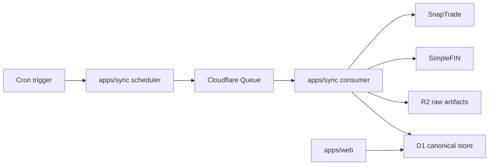

# Blueprint 0001: Vista v1 Repository Blueprint

- Status: Draft
- Date: 2026-03-15
- Related:
  - `docs/prd/0001-v1-household-financial-snapshot.md`
  - `docs/adr/0001-data-ingestion-strategy.md`
  - `docs/adr/0002-normalized-data-model-and-sync-workflow.md`

## Purpose

This document turns the current product and architecture decisions into a concrete repository plan for implementation.

It defines:

- the recommended monorepo structure
- the initial runtime and deployment boundaries
- the package responsibilities
- the storage and sync topology
- the local development model
- the testing and delivery workflow

This blueprint is intended to be specific enough that the repository can be scaffolded directly from it without introducing unnecessary platform complexity.

## Design Goals

The repository should optimize for:

- correctness and traceability of financial data
- clean separation between provider sync and product reads
- low operational overhead for a small v1 team
- a short path from blueprint to working product
- room to scale beyond one household without premature platform sprawl

## Non-Goals

This blueprint does not optimize for:

- microservice decomposition
- real-time event streaming
- a public API platform
- multi-region write coordination
- warehouse-style analytics
- a generic plugin ecosystem for many providers in v1

## Recommended Stack

### Core choices

- Monorepo: `pnpm` workspaces
- Language: `TypeScript` with strict mode enabled
- Web app: `React Router v7` in framework mode on Cloudflare
- Sync runtime: dedicated `Cloudflare Worker`
- Database: `Cloudflare D1`
- Object storage: `Cloudflare R2`
- Background queueing: `Cloudflare Queues`
- Scheduling: `Cloudflare Cron Triggers`
- Auth: `Clerk`
- Validation: `Zod`
- ORM / SQL tooling: `Drizzle ORM` and `drizzle-kit`
- Formatting and linting: `Biome`
- Unit and integration testing: `Vitest`
- End-to-end testing: `Playwright`
- Deployments: `Wrangler` plus `GitHub Actions`

### Why this stack

- Cloudflare is already the documented runtime direction in ADR 0002.
- D1 is a reasonable v1 fit for relational household finance data, daily snapshots, and precomputed reporting facts.
- Separate web and sync workers reduce coupling between provider credentials, scheduled jobs, and user-facing code.
- React Router keeps the product surface simple while still fitting Cloudflare deployment cleanly.
- Drizzle provides typed schema ownership without hiding SQL-heavy data work behind too much abstraction.
- Queues are enough for daily fan-out and retry without adding workflow orchestration overhead too early.

## Architecture Overview

Vista should start as a two-application monorepo:

1. `apps/web`
2. `apps/sync`

Shared code lives in workspace packages, not in direct cross-app relative imports.

### Runtime responsibilities

#### `apps/web`

Responsibilities:

- render the responsive product UI
- handle authenticated product reads
- handle lightweight user mutations such as renaming accounts, setting ownership, changing visibility, or excluding accounts from reporting
- read only from canonical and reporting tables

Constraints:

- must not call provider APIs directly
- must not own sync orchestration
- must not contain provider secrets

#### `apps/sync`

Responsibilities:

- run scheduled sync entrypoints
- consume queue messages for provider connections
- call SimpleFIN and SnapTrade APIs
- write provider-layer tables
- normalize provider data into canonical tables
- rebuild reporting facts after sync

Constraints:

- should expose only minimal internal or admin endpoints
- should be the only application allowed to import provider connector packages

## Repository Layout

The initial repository should follow this structure:

```text
/
  apps/
    web/
      app/
        routes/
        components/
        lib/
        styles/
      public/
      worker/
      tests/
      package.json
      tsconfig.json
      wrangler.jsonc
    sync/
      src/
        handlers/
        jobs/
        lib/
      tests/
      package.json
      tsconfig.json
      wrangler.jsonc
  packages/
    db/
      drizzle/
      src/
        schema/
        queries/
        migrations/
        seeds/
      package.json
      tsconfig.json
    domain/
      src/
        accounts/
        balances/
        holdings/
        reporting/
        sync/
        visibility/
      package.json
      tsconfig.json
    providers/
      shared/
        src/
      simplefin/
        src/
      snaptrade/
        src/
      package.json
      tsconfig.json
    ui/
      src/
      package.json
      tsconfig.json
  docs/
    adr/
    blueprint/
    prd/
  scripts/
    bootstrap-d1.ts
    backfill-reporting.ts
  .github/
    workflows/
      ci.yml
      deploy.yml
  biome.json
  package.json
  pnpm-workspace.yaml
  tsconfig.base.json
```

## Package Responsibilities

### `packages/db`

Owns:

- Drizzle schema definitions
- migrations
- query helpers shared across apps
- database connection utilities for D1 bindings
- seed data for local development

Rules:

- schema is the source of truth for table definitions
- business logic does not live here
- provider normalization should not be implemented as raw SQL in this package

### `packages/domain`

Owns:

- canonical finance logic
- money and date semantics
- ownership, visibility, and reporting inclusion rules
- sync orchestration steps
- fact-building logic for net worth, cashflow, and portfolio reporting

Rules:

- this package should be framework-agnostic
- code here should be testable without React Router or Wrangler
- external APIs should enter through typed interfaces, not direct fetch calls

### `packages/providers/shared`

Owns:

- shared provider primitives
- common fetch wrappers
- rate-limit and retry helpers
- provider error normalization
- raw artifact redaction helpers

### `packages/providers/simplefin`

Owns:

- SimpleFIN API client
- SimpleFIN payload validation
- mapping from SimpleFIN entities to Vista canonical write models

### `packages/providers/snaptrade`

Owns:

- SnapTrade API client
- SnapTrade payload validation
- mapping from SnapTrade entities to Vista canonical write models

### `packages/ui`

Owns:

- shared presentational components
- chart primitives
- money and date display helpers for the UI

Rules:

- do not move product data fetching into this package
- keep business rules out of reusable presentational components

## Application Boundaries

### Web app boundary

The web app should read from:

- `accounts`
- `account_visibility_settings`
- `balance_snapshots` when history is needed
- `account_balance_latest`
- `daily_net_worth_facts`
- `monthly_cashflow_facts`
- `portfolio_allocation_facts`

The web app should write only lightweight curation data such as:

- `display_name`
- `ownership_type`
- `include_in_household_reporting`
- visibility and privacy settings
- hide or archive markers for product presentation

### Sync app boundary

The sync worker should own writes to:

- `provider_connections`
- `provider_accounts`
- `sync_runs`
- `sync_checkpoints`
- `raw_import_artifacts`
- `accounts`
- `balance_snapshots`
- `transactions`
- `holdings`
- `holding_snapshots`
- reporting fact tables

The sync worker may also update:

- derived current-state tables such as `account_balance_latest`

## Data and Storage Blueprint

### Primary storage

Use `Cloudflare D1` as the system of record for:

- provider metadata
- canonical account data
- snapshot history
- transactions used for reporting
- precomputed reporting facts
- user curation settings

### Secondary storage

Use `Cloudflare R2` for:

- selected raw provider payload artifacts
- redacted debugging payloads
- import reconciliation exports

Guidance:

- do not store every raw payload forever by default
- store failure artifacts, edge-case payloads, and targeted reconciliation blobs
- keep raw payload storage intentionally narrow because the data is sensitive

## Initial Schema Blueprint

The first implementation should create the following table groups.

### Identity and household tables

- `households`
- `members`
- `member_household_roles`

### Auth linkage tables

- `user_identities`

This table links the external auth provider user identifier to Vista member records.

### Provider connection tables

- `provider_connections`
- `provider_accounts`
- `sync_runs`
- `sync_checkpoints`
- `raw_import_artifacts`

### Canonical finance tables

- `accounts`
- `account_visibility_settings`
- `balance_snapshots`
- `transactions`
- `holdings`
- `holding_snapshots`

### Reporting and read-model tables

- `daily_net_worth_facts`
- `monthly_cashflow_facts`
- `portfolio_allocation_facts`
- `account_balance_latest`

### Schema rules

- money values are stored as integer minor units
- all timestamps are stored in UTC
- account and transaction source identifiers are preserved for reconciliation
- snapshot tables are append-only
- privacy, ownership, and household inclusion remain separate concerns

## Sync Topology

The sync system should use scheduled fan-out instead of one large scheduled job.

### Flow

1. A Cron Trigger starts the `apps/sync` worker on the daily schedule.
2. The scheduler handler queries active provider connections from D1.
3. The scheduler enqueues one queue message per provider connection.
4. Queue consumers process connections independently.
5. Each consumer records a `sync_run`, fetches provider data, normalizes it, writes snapshots, rebuilds affected facts, and advances checkpoints only on success.

### Why this shape

- one failing connection should not block all others
- retries are easier to isolate
- provider-specific concurrency can be controlled later without redesigning the whole app
- this keeps the scheduled entrypoint short and predictable

### Mermaid diagram



## Web Product Surface Blueprint

The initial route structure should stay close to the PRD and avoid route sprawl.

### Initial route groups

- `/`
- `/accounts`
- `/accounts/:accountId`
- `/settings/accounts`
- `/settings/connections`
- `/settings/privacy`
- `/signin`
- `/onboarding`

### Route intent

- `/` is the household snapshot home screen
- `/accounts` supports grouped account browsing beyond the home page summary
- `/accounts/:accountId` explains current balance, trend, and change context for one account
- settings routes handle rare curation tasks, not daily workflows

## Auth Blueprint

Use `Clerk` as the initial auth provider.

Reasons:

- faster path to production-ready email and session flows
- less custom auth surface to secure during early development
- simpler onboarding for a couples-oriented web product

Integration model:

- Clerk owns authentication and session state
- Vista stores app-level identity and household membership in D1
- `user_identities` links Clerk user IDs to Vista members

Boundary rule:

- auth provider identifiers must not replace app-owned household and member concepts

Fallback path:

- if minimizing vendor count becomes more important than implementation speed, move to Better Auth on D1 later without changing the core app model

## API and Server Interaction Model

The v1 repository should avoid a separate public API service.

Recommended model:

- React Router loaders and actions serve the web app
- resource routes may return JSON where the UI benefits from it
- the sync worker exposes only narrow internal endpoints if required

Avoid in v1:

- GraphQL
- separate BFF layer
- public REST surface designed for third-party clients

## Environment and Configuration

### Root configuration files

Create these files at the repository root:

- `package.json`
- `pnpm-workspace.yaml`
- `tsconfig.base.json`
- `biome.json`
- `.gitignore`
- `.env.example`

### App configuration files

Each app should own its own:

- `wrangler.jsonc`
- `.dev.vars.example`
- `tsconfig.json`

### Suggested environment variables

#### Shared

- `APP_ENV`
- `LOG_LEVEL`

#### Web app

- `CLERK_PUBLISHABLE_KEY`
- `CLERK_SECRET_KEY`
- `COOKIE_ENCRYPTION_SECRET`

#### Sync app

- `SIMPLEFIN_CLIENT_ID`
- `SIMPLEFIN_CLIENT_SECRET`
- `SNAPTRADE_CLIENT_ID`
- `SNAPTRADE_CONSUMER_KEY`
- `PROVIDER_TOKEN_ENCRYPTION_KEY`

### Binding guidance

Use Cloudflare bindings for:

- `D1Database`
- `R2Bucket`
- `Queue`
- secrets

Rules:

- provider refresh tokens must be encrypted before storage in D1
- encryption key versioning should be designed in from the start
- secrets must never be committed to the repository

## Local Development Model

Local development should support working on either app independently while sharing the same packages.

### Recommended commands

- `pnpm install`
- `pnpm dev:web`
- `pnpm dev:sync`
- `pnpm lint`
- `pnpm typecheck`
- `pnpm test`
- `pnpm e2e`

### Local data model

- use local D1 databases for development and tests
- provide seed scripts for one sample household with representative account types
- include synthetic provider payload fixtures for connector tests

### Fixture strategy

Store provider fixtures as redacted test data under package-local test directories, not in production seed flows.

## Testing Blueprint

### Unit tests

Use `Vitest` for:

- money and date utilities
- ownership and visibility rules
- provider mapping logic
- reporting fact builders
- sync idempotency rules

### Integration tests

Use integration tests for:

- D1 schema queries and migrations
- sync pipeline behavior against test fixtures
- checkpoint advancement rules
- deduplication of transactions and snapshots

### End-to-end tests

Use `Playwright` for:

- sign-in flow
- onboarding flow
- home screen snapshot rendering
- account settings updates

### Required pre-merge checks

- lint passes
- typecheck passes
- unit tests pass
- integration tests pass
- both apps build successfully

## CI and Deployment Blueprint

### CI

Use `GitHub Actions` for pull requests and main-branch verification.

Initial CI steps:

1. install dependencies
2. run lint
3. run typecheck
4. run tests
5. build `apps/web`
6. build `apps/sync`

### Deployment environments

Start with:

- `dev`
- `prod`

Each environment gets:

- its own D1 database
- its own R2 bucket
- its own queue
- its own Worker names

### Deployment rules

- deploy the web worker and sync worker independently
- run D1 migrations before application deploys that depend on new schema
- keep sync disabled or scoped in `dev` when provider credentials are not configured

## Coding and Boundary Rules

### Allowed dependencies by layer

- `apps/web` may depend on `packages/db`, `packages/domain`, and `packages/ui`
- `apps/sync` may depend on `packages/db`, `packages/domain`, and `packages/providers`
- `packages/domain` must not depend on React Router, Clerk, or Wrangler-specific app code
- `packages/providers` must not depend on UI packages

### General rules

- no provider API calls from the web app
- no UI code in provider packages
- no raw SQL scattered across route files
- no financial calculations using floating-point arithmetic
- no direct reads from provider-layer tables for user-facing reporting

## Initial Implementation Sequence

Build the repository in this order:

1. scaffold the monorepo and shared toolchain
2. add D1 schema and migrations for canonical and provider tables
3. add the sync worker shell with Cron and Queue handlers
4. implement SimpleFIN connector end to end
5. implement SnapTrade connector end to end
6. implement reporting fact builders
7. scaffold the web app and auth
8. build the home screen snapshot UI
9. build lightweight account curation screens
10. add Playwright smoke coverage

## Explicitly Deferred

The repository should not include these in the first blueprint implementation:

- GraphQL
- Turbo or Nx
- event sourcing
- real-time sync infrastructure
- mobile apps
- generalized plugin loading for arbitrary providers
- manual asset tracking features
- a ledger-grade transaction browser

## Risks and Review Triggers

Revisit this blueprint if any of the following become true:

- D1 query patterns become a bottleneck for reporting fact rebuilds
- provider retry behavior requires step-level orchestration beyond queue retries
- auth requirements change enough that Clerk becomes a poor fit
- the product expands into real-time monitoring
- multi-household scale makes the current app and sync split insufficient

## First Scaffolding Checklist

The first repository scaffolding pull request should include:

- root workspace config
- both app shells
- shared TypeScript config
- Biome config
- Drizzle setup
- initial D1 schema
- Wrangler configs for both apps
- example environment files
- CI workflow

## Open Questions

1. Should the web app use React Router resource routes for all dashboard data reads, or should some reads stay fully loader-driven at the route level?
2. Should raw import artifacts be written only on failures, or also for sampled successful syncs used for reconciliation?
3. How much of account privacy should ship in the first UI milestone versus being modeled in schema first and surfaced later?
